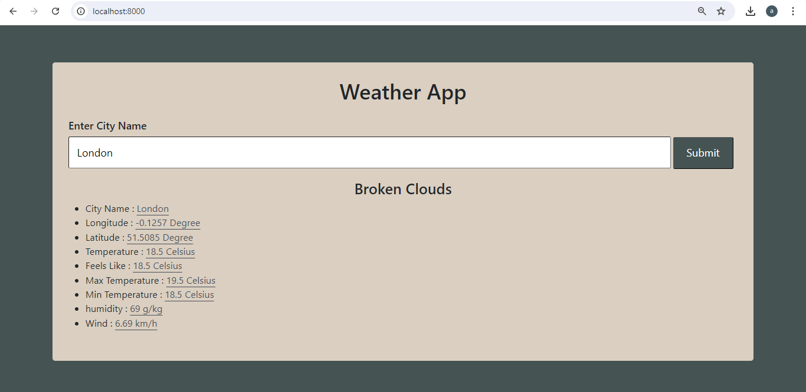

# Django Weather Project
This Django project provides real-time weather information by calling the OpenWeatherMap API. Users can search for the current weather conditions of any city, and the application retrieves and displays detailed data such as temperature, humidity, and weather descriptions. This project showcases how to effectively utilize third-party APIs within a Django framework, offering a practical and accessible solution for accessing weather information.

## Get Api Key

Go to this link and sign up.

`https://home.openweathermap.org/`

After sign up, go to this link to get api key.

`https://home.openweathermap.org/api_keys`

## 🛠 Skills
HTML, CSS, Python, Django, Bootstrap

## Screenshots

